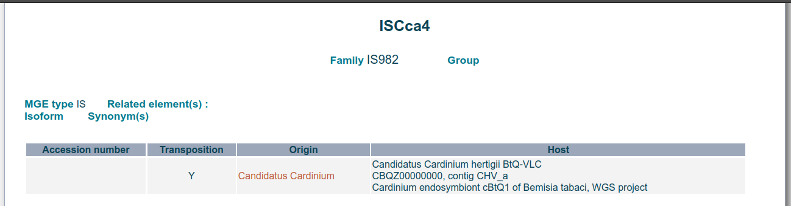
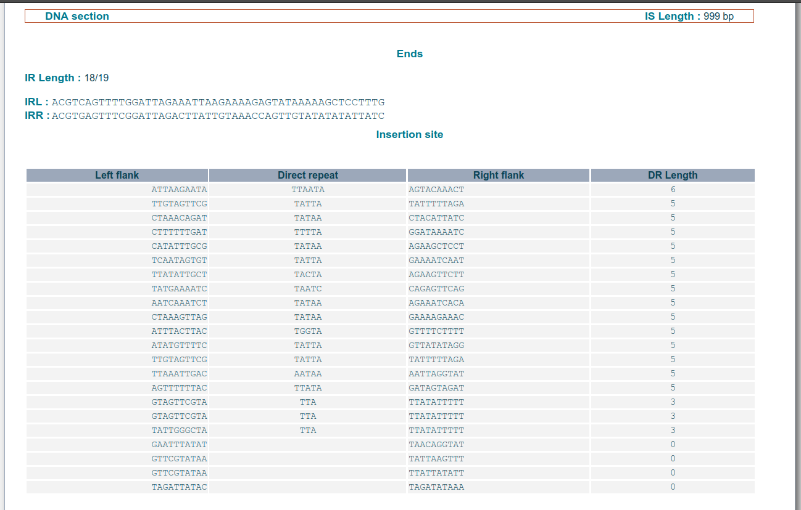

# Part 2: ISfinder database
ISfinder is a large centralised database of IS elements of Bacteria and Archaea. It also serves as a valuable resource for annotation of similar and related IS elements to those in the database. In fact, popular annotation pipelines, such as [Prokka](https://github.com/tseemann/prokka) or [Bakta](https://github.com/oschwengers/bakta?tab=readme-ov-file#database), use this database to make predictions on open reading frames (or predicted proteins).

## Interface
### Homepage

 

#### > Search function
Used to search specific ISs by name, type, etc.

Let's search!

### > Search
XXX

#### Let's type in "ISCca4"

##### We get 1 result

#### ISCca4
##### Details

##### DNA section: Ends & insertion site

##### DNA section: Inverted repeats (IRL and IRR)

##### DNA section: sequence

##### Protein section

##### Comments

##### References

 

#### Blast function
Used to search the database using a sequence as input

Let's BLAST!

### > BLAST
XXX

#### Let's type in "ISCca4"

##### We get 1 result

#### ISCca4
##### Details

##### DNA section: Ends & insertion site

##### DNA section: Inverted repeats (IRL and IRR)

##### DNA section: sequence

##### Protein section

##### Comments

##### References

 

 

## BLASTing a sequence to identify hits

## Publications
Siguier P, Perochon J, Lestrade L, Mahillon J, Chandler M. ISfinder: the reference centre for bacterial insertion sequences. *Nucleic acids research* 2006;34:D32-6. [https://doi.org/10.1093/nar/gkj014](https://doi.org/10.1093/nar/gkj014).

Siguier P, Varani A, Perochon J, Chandler M. *Exploring bacterial insertion sequences with ISfinder: objectives, uses, and future developments*. In: Bigot Y (editor). *Mobile Genetic Elements: Protocols and Genomic Applications*. Totowa, NJ: Humana Press. pp. 91–103. [https://doi.org/10.1007/978-1-61779-603-6_5](https://doi.org/10.1007/978-1-61779-603-6_5).

👷🏽🏗️ Under construction....
