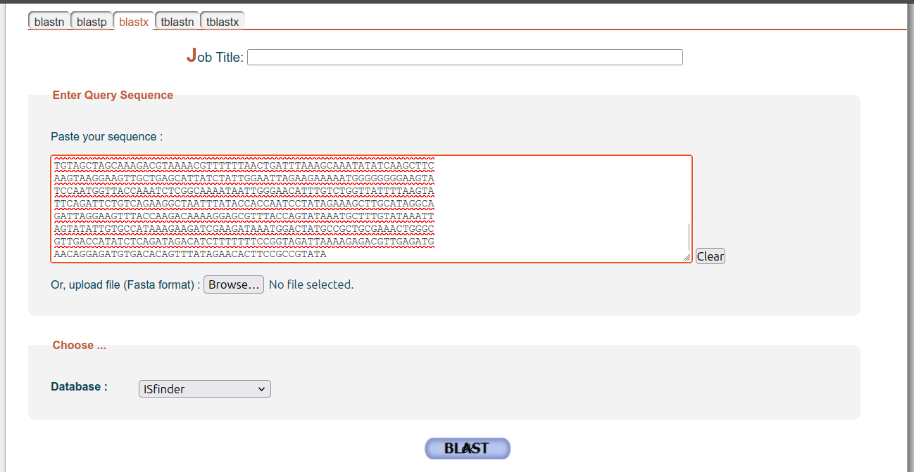
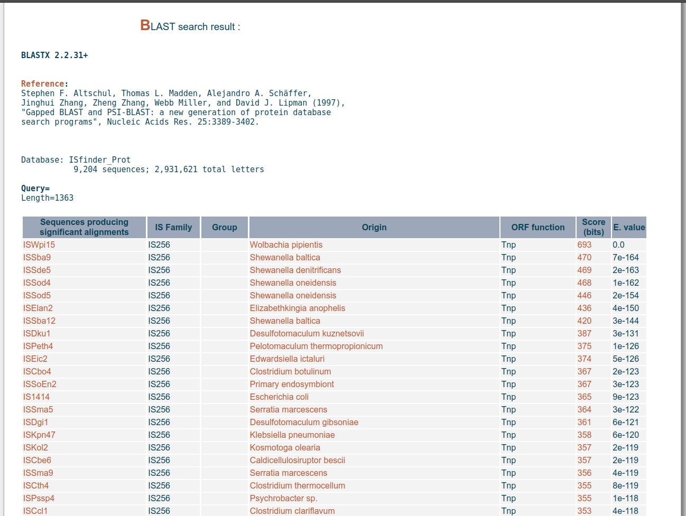
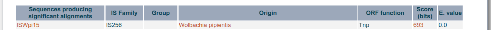
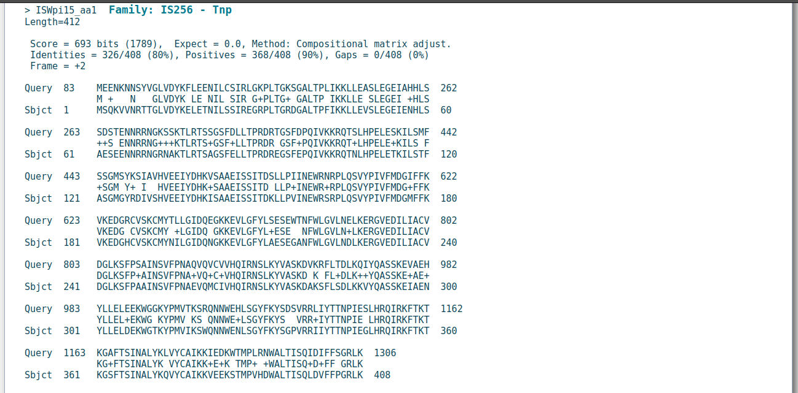
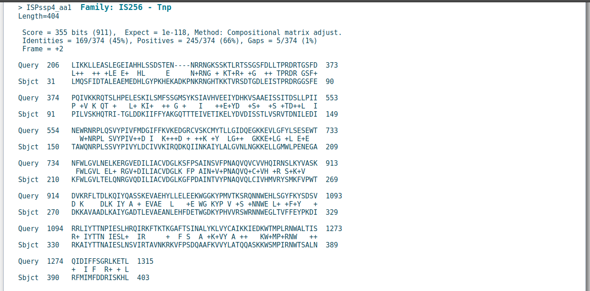
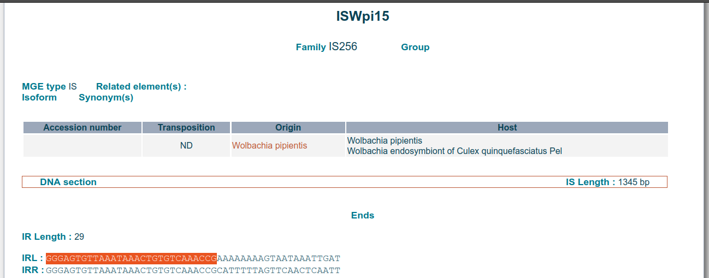
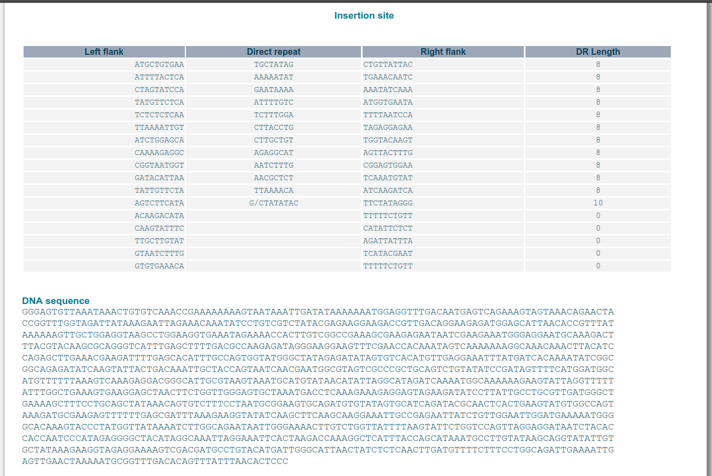

# Part 3: Annotation of a "typical" IS element (together)
👷🏽🏗️ Under construction....

## Annotate ISCca4
For this part we will revisit the transposase `ISCca4` from *Cardinium* bacteria. So, let's go ahead and download the [`ISCca4.fasta`](./data/ISCca4.fasta) (right click 🖱️ and download).

- Drag the downloaded file (`ISCca4.fasta`) into UGENE or open it (Top-left corner `File -> Open`).

  
  <br/><br/>

  - Click on the "Select sequence region" button ().

    
    <br/><br/>

  - We can choose any range from 1 - n (n= maximun length of sequence). By default, we get from start to end, unless we preselect manually a certain range. Let's then proceed and hit that   button.

    
    <br/><br/>

- Now lets copy that sequence (<kbd>Ctrl + C</kbd>) and paste it (<kbd>Ctrl + V </kbd>) into ISfinder's BLAST's (`blastx`) search box.

  
  <br/><br/>

  - We then go to the top hit (`ISCca4`) and click on the bit score (`511` 🖱️).

    
    <br/><br/>

  - Now let's look at the alignment.
    - Did we detect a transposase gene?
    - Which family?
    - Is it complete?
    - Are we dealing with the same transposase?
    
    
    <br/><br/>

- Back in UGENE, let's now annotate the transposase gene.
  - First, lets use gain that "Select sequence region" button ()
    
    <br/><br/>

## Interface
### Homepage
[https://isfinder.biotoul.fr](https://isfinder.biotoul.fr/)


#### References
Siguier P, Perochon J, Lestrade L, Mahillon J, Chandler M. ISfinder: the reference centre for bacterial insertion sequences. *Nucleic acids research* 2006;34:D32-6. [https://doi.org/10.1093/nar/gkj014](https://doi.org/10.1093/nar/gkj014).

Siguier P, Varani A, Perochon J, Chandler M. *Exploring bacterial insertion sequences with ISfinder: objectives, uses, and future developments*. In: Bigot Y (editor). *Mobile Genetic Elements: Protocols and Genomic Applications*. Totowa, NJ: Humana Press. pp. 91–103. [https://doi.org/10.1007/978-1-61779-603-6_5](https://doi.org/10.1007/978-1-61779-603-6_5).
<br/>

---
### > Search function
Used to search specific ISs by name, type, etc.


<details>

<summary>Let's search!</summary>
<br/>

In the "Search" interface, we can do simple free-text search. In addition, we can further refine our search by adding family, group, host, MGBE type, accession number, and other text-based filtering.


<br/><br/>

- Let's type in "ISCca4"


<br/><br/>

- We get 1 result


<br/><br/>

- ISCca4
  - Details
    
    
    <br/><br/>

  - DNA section: Ends & insertion site
    
    
    <br/><br/>

  - DNA section: Inverted repeats (IRL and IRR)
    
    
    <br/><br/>

  - DNA section: Sequence
    
    
    <br/><br/>

  - Protein section
    
    
    <br/><br/>

  - Comments
    
    
    <br/><br/>

  - References
    
    
    <br/><br/>

</details>
<br/>

---
### > Blast function
Used to search the database using a sequence as input


<details>

<summary>Let's BLAST!</summary>
<br/>

ISfinder provides many different BLAST algorithms:

| BLAST type  | Description                                         |
| ----------: | :-------------------------------------------------- |
| **blastn**  | nucleotides *vs.* nucleotides                       |
| **blastp**  | proteins *vs.* proteins                             |
| **blastx**  | translated nucleotides *vs.* proteins               |
| **tblastn** | protein *vs.* translated nucleotides                |
| **tblastx** | translated nucleotides *vs.* translated nucleotides |


<br/><br/>

- Let's search our fist sequence

Lets copy and paste the following sequence into the "Query Sequence text-search box".

```
GCCGTATAGGAAGTGTTCTATAAACTGTGTCAAGGCGATAAAAAGTTATAAATTAATTAA
ATAAACATTAAAGGTTTTAGACATGGAAGAAAATAAGAACAATTCCTATGTTGGTTTAGT
AGATTACAAATTTCTGGAGGAAAATATTTTGTGCTCTATCCGTTTAGGTAAGCCTTTAAC
AGGAAAAAGTGGTGCTTTAACGCCTCTGATAAAAAAGCTTCTAGAGGCAAGTCTAGAAGG
TGAAATAGCACACCATTTATCTAGTGATTCAACAGAAAATAATAGAAGAAATGGAAAAAG
CTCTAAAACTTTACGCACAAGTTCTGGTTCCTTTGATCTGCTAACTCCTAGGGATAGGAC
AGGTAGTTTCGATCCACAAATAGTTAAAAAGCGTCAAACAAGCCTACATCCTGAGCTGGA
AAGCAAGATCTTAAGCATGTTTTCTAGTGGTATGAGCTATAAATCTATAGCCGTTCATGT
TGAAGAGATCTATGATCATAAAGTATCAGCTGCTGAAATATCATCTATTACAGATAGCTT
GTTACCGATAATAAATGAATGGCGTAACCGCCCTCTTCAATCAGTTTATCCGATAGTTTT
CATGGATGGGATATTTTTTAAGGTAAAAGAAGATGGCAGATGTGTAAGCAAATGCATGTA
TACCTTATTAGGCATAGATCAAGAGGGTAAAAAAGAAGTATTGGGATTTTATTTGTCTGA
AAGTGAGTGGACTAACTTCTGGTTGGGTGTACTTAACGAGCTTAAGGAAAGAGGTGTAGA
AGATATCCTTATTGCCTGTGTTGATGGCCTAAAAAGCTTTCCTTCAGCCATAAATAGCGT
TTTCCCTAATGCACAAGTGCAGGTCTGTGTAGTACATCAGATACGAAACTCACTCAAGTA
TGTAGCTAGCAAAGACGTAAAACGTTTTTTAACTGATTTAAAGCAAATATATCAAGCTTC
AAGTAAGGAAGTTGCTGAGCATTATCTATTGGAATTAGAAGAAAAATGGGGGGGGAAGTA
TCCAATGGTTACCAAATCTCGGCAAAATAATTGGGAACATTTGTCTGGTTATTTTAAGTA
TTCAGATTCTGTCAGAAGGCTAATTTATACCACCAATCCTATAGAAAGCTTGCATAGGCA
GATTAGGAAGTTTACCAAGACAAAAGGAGCGTTTACCAGTATAAATGCTTTGTATAAATT
AGTATATTGTGCCATAAAGAAGATCGAAGATAAATGGACTATGCCGCTGCGAAACTGGGC
GTTGACCATATCTCAGATAGACATCTTTTTTTCCGGTAGATTAAAAGAGACGTTGAGATG
AACAGGAGATGTGACACAGTTTATAGAACACTTCCGCCGTATA
```

<br/><br/>

- After a BLAST search, we get a results table, organised from higher (top) to lower (bottom) bit score<sup>1</sup> and E-value<sup>2</sup>


<br/><br/>

<details>

<summary><sup>1,2</sup></summary>

- <sup>1</sup> Bit score
  - Represents the alignment quality between the query sequence()s and target sequence (a higher bit score represents higher similarity).
  - It is a normalized score (adjusted for scoring parameters such as substitution matrix and gap penalty), and thus useful for comparing the alignments obtained using different scoring parameters.
Summarise the sequence similarity between the query and database hit.
  - A higher bit score indicates a better hit.

- <sup>2</sup> E-value (Expectation Value)
  - Statistical value that estimates how likely it is that the number of alignments with a bit score equal to or greater than the observed score could be found by chance when comparing query sequences with the target database.
  - Depends on the bit score, query sequence length, and the size of the target database.
  - A lower E-value indicates a better hit.

** Further reading [here 🔗](https://www.reneshbedre.com/blog/blast-e-value.html)

</details>

- Let's look at the top BLAST hit. Click on the bit score (<kbd>693</kbd>🖱️).

  
  <br/><br/>

  - Sequence *vs.* ISWpi15

    
    <br/><br/>

- Let's look at a worst BLAST hit. Search and find `ISPssp4` and click on the bit score (<kbd>355</kbd>🖱️).

  
  <br/><br/>

  - Sequence *vs.* ISPssp4

    
    <br/><br/>

- Let's go back to our result table and find the top hit `ISWpi15`. This time, let's click on the IS element name (<kbd>ISWpi15</kbd>🖱️).


<br/><br/>

- ISWpi15
  - Details & DNA section: Ends
    
    
    <br/><br/>

  - DNA section: Insertion site & sequence
    
    
    <br/><br/>

  - Protein section, comments, & references
    
    
    <br/><br/>

</details>
<br/>
<br/>

<p align="right">
    <kbd> <br> <a href="./Part_3.md"><big><b>Next: Part 3</b></big></a> <br> </kbd>
</p>
