# Part 3: Annotation of a "typical" IS element (together)

## Annotate ISCca4
For this part we will revisit the transposase `ISCca4` from *Cardinium* bacteria. So, let's go ahead and download the [`ISCca4.fasta`](./data/ISCca4.fasta) (right click 🖱️, open in new tab, then hit the "Dowload raw file" button at the top-right of the viewer).

- Drag the downloaded file (`ISCca4.fasta`) into UGENE or open it (Top-left corner `File -> Open`).

  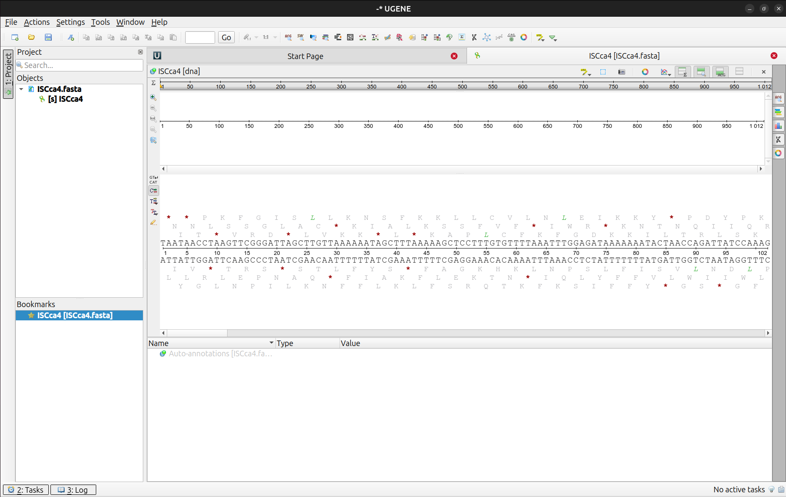
  <br/><br/>

  - Click on the "Select sequence region" button (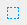).

    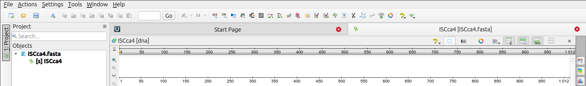
    <br/><br/>

  - We can choose any range from 1 - n (n= maximun length of sequence). By default, we get from start to end, unless we preselect manually a certain range. Let's then proceed and hit that   button.

    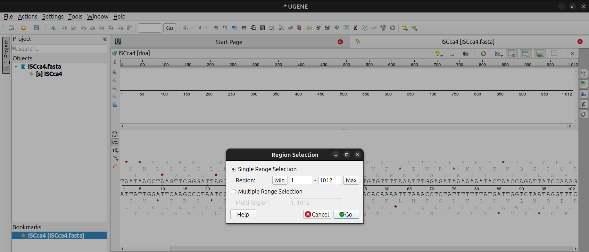
    <br/><br/>

- Now lets copy that sequence (press <kbd>Ctrl + C</kbd> ⌨️) and paste it (press <kbd>Ctrl + V </kbd> ⌨️) into ISfinder's BLAST's (`blastx`) search box.

  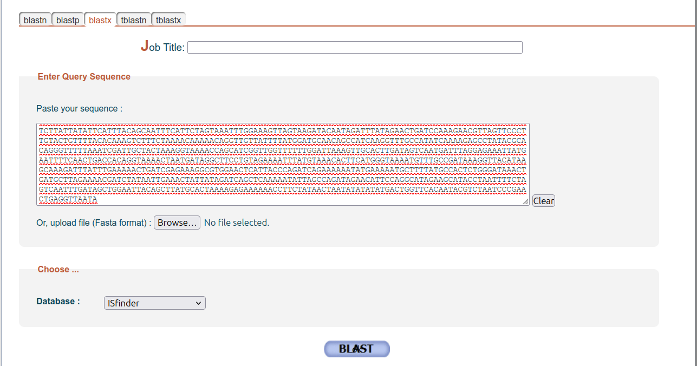
  <br/><br/>

  - We then go to the top hit (`ISCca4`) and click on the bit score (`511` 🖱️).

    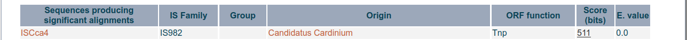
    <br/><br/>

  - Now let's look at the alignment.
    - Did we detect a transposase gene?
    - Which family?
    - Is it complete?
    - Are we dealing with the same transposase?
    
    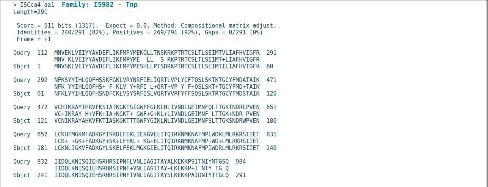
    <br/><br/>

### CDS
<details>
  
  <summary>See more</summary>
  
  - Back in UGENE, let's now annotate the transposase gene.
    - First, let's use gain that "Select sequence region" button () and input the range of the BLAST hit (`112 - 982`).

      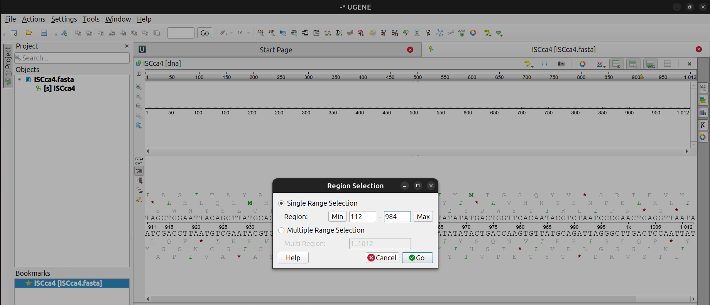
      <br/><br/>

    - Transposase gene start: `MNVEKLVEI...`. Does it look good?

      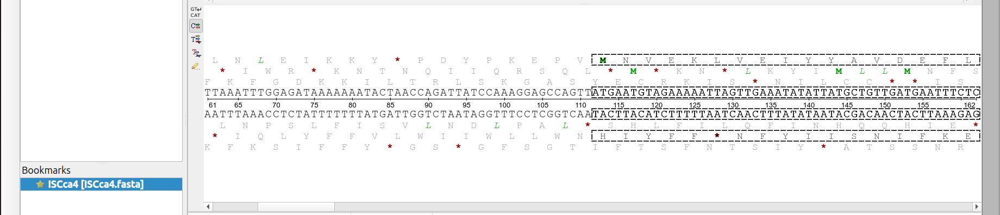
      <br/><br/>

    - Transposase gene end: `...TNIYMTGSQ`. Does it look good?

      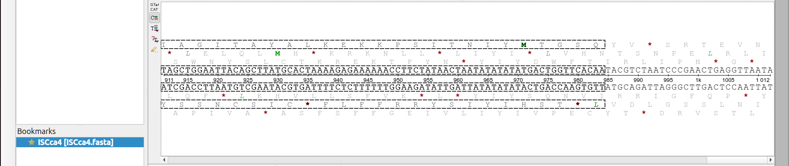
      <br/><br/>

    - Let's modify the end so that it includes the stop codon (*) to `112 - 993` using the "Select sequence region" button ().

      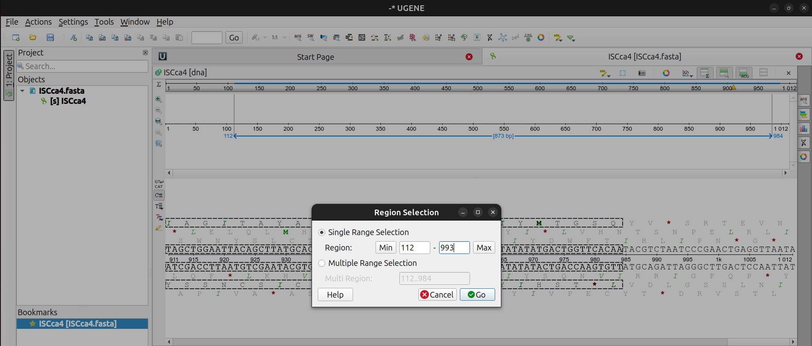
      <br/><br/>

    - We have now the whole coding sequence (CDS)* selected.

      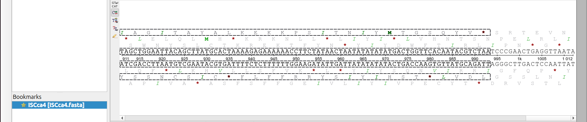
      \** CDS: portion of a gene that is translated into protein. It begins with a start codon (ATG, GTG, TTG) and ends with a stop codon (*).
      <br/><br/>

    - Let's click (<kbd>Ctrl + N</kbd>) 🖱️. This will open the "Create Annotation" window. We will select `CDS` from the "Annotation type" menu, and write `CDS` in both "Group name" and "Annotation name" fields. Now let's click  🖱️.

      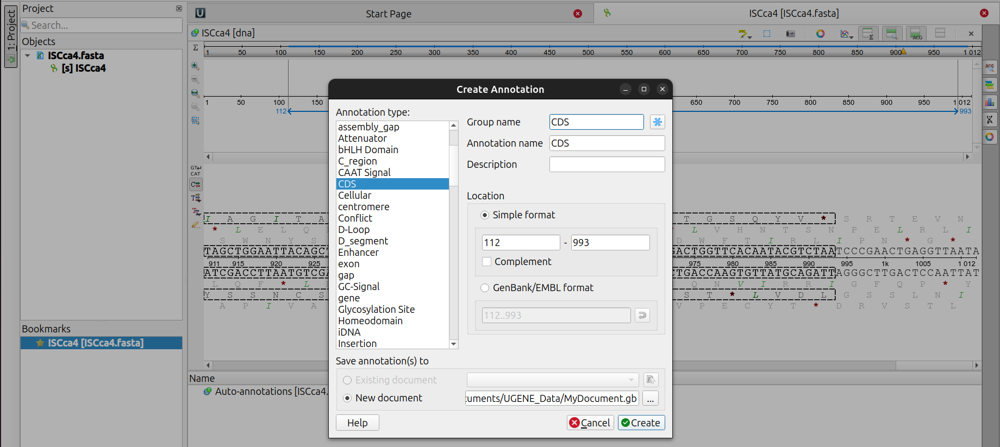
      <br/><br/>

    - We have our first CDS!

      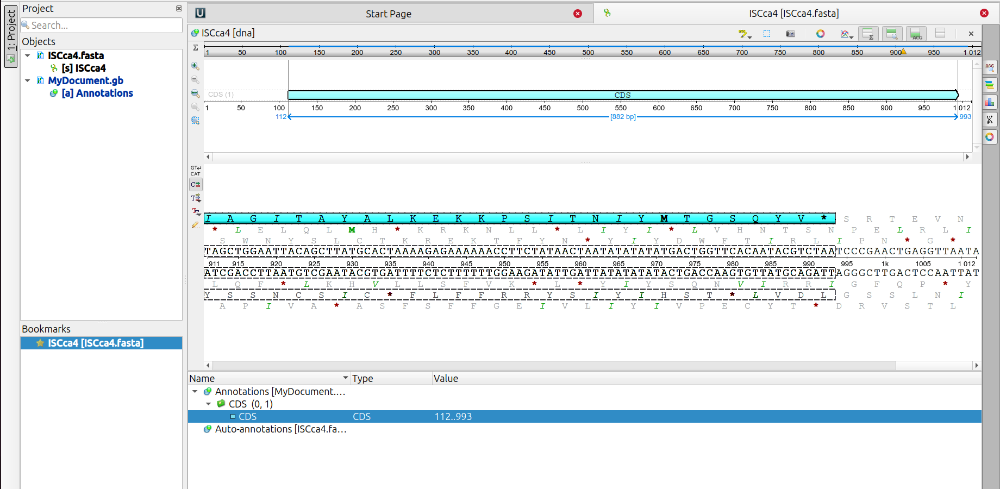
      <br/><br/>

    - Now, time to add some qualifiers (additional fields to the `CDS` feature). This is achieved by selecting the `CDS` and then pressing <kbd>Insert</kbd> ⌨️. You will get an "Add new qualifier" pop-up window to type in: 
      - Name: `codon_start`, Value: `1`.
    
        
        <br/><br/>

      - Name: `transl_table`, Value: `11`.

        
        <br/><br/>

      - Name: `product`, Value: `Transposase ISCca4, IS982 family`.

        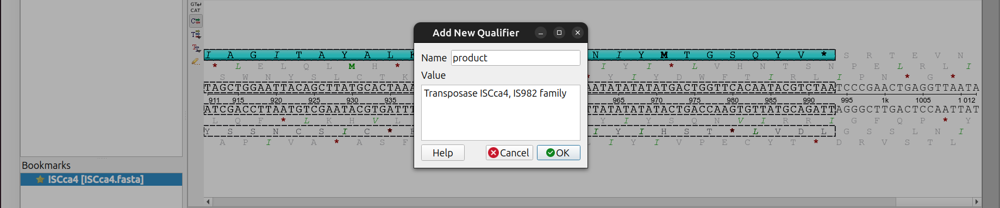
        <br/><br/>

      - Name: `translation`, Value: `MNVEKLVEIYYAVDEFLIKFMPYMEKQLLTNSKRKPTRTCSLTLSEIMTVLIAFHVIGFRNFKSYYIHLQQFHSSKFGKLVRYNRFIELIQRTLVPLYCFTQSLSKTKTGCYFMDATAIKVCHIKRAYTHRVFKSIATKGKTSIGWFFGLKLHLIVNDLGEIMNFQLTTGKTNDRLPVENLCKHFMGKMFADKGYISKDLFEKLIEKGVELITQIRKNMKNAFMPLWDKLMLRKRSIIETIIDQLKNISQIEHSRHRSIPNFLVNLIAGITAYALKEKKPSITNIYMTGSQYV`.
        To paste translation in the "Value" field (<kbd>Ctrl + V</kbd> ⌨️), with the `CDS` feature selected, first copy the translation of the feature (press <kbd>Ctrl + T</kbd> ⌨️).

        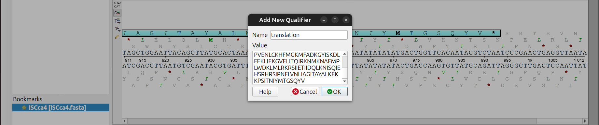
        <br/><br/>

    - Great work! Now, our transposase gene is annotated!

      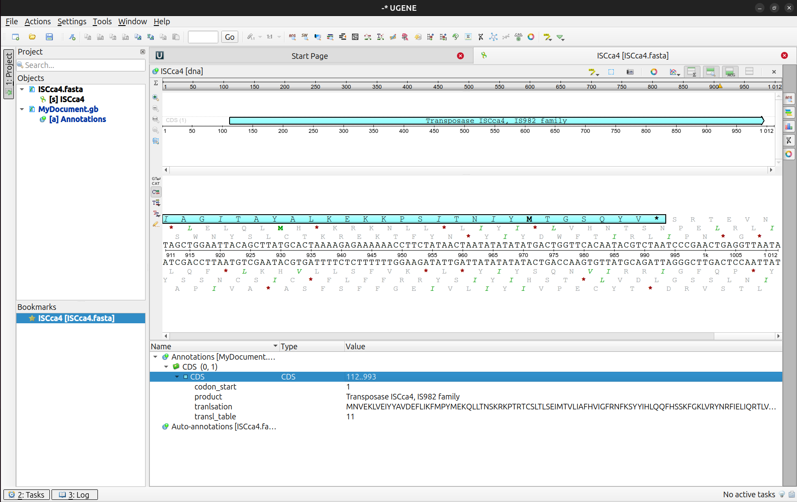

</details>

---

### Repeats
What about the repeats? How would you go about discovering if this transposase is flanked or not by inverted/direct repeats?

#### Direct repeats
<details>
  
  <summary>See more</summary>
  
  - First, lets grab the first 10 and last 10 nucleotides to search for **direct repeats**. We can do this using the "Select sequence region" button () 🖱️, setting the ranges `1..10` and `1003..1012` and then clicking  🖱️. Once region is selected, press <kbd>Ctrl + C</kbd> ⌨️ to copy.

    NOTE: In this case, we are working with a full transposase gene. Usually, it makes more sense to search for inverted repeats first, as they are longer.
    
    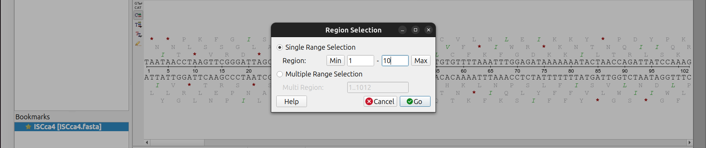
    <br/>
 
    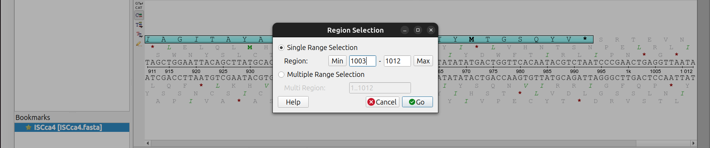
    <br/><br/>

  - We can go ahead and align these sequences, but it makes more sense to visually inspect them.
   
    Solution 1:
    
    ```
    --------TAATAACCTA # start
    GAGGTTAATA-------- # end
    ```
    
    Solution 2:
    
    ```
    -----TAATAACCTA # start
    GAGGTTAATA----- # end
    ```
    
    Any others?
    <br/><br/>

  - To create the annotations, manually select the direct repeats at the start (`1 - 5`) and end (`1008 - 1012`) of the sequence. For each, press <kbd>Ctrl + N</kbd> ⌨️. This will open the "Create Annotation" window. We will select `repeat_region` from the "Annotation type" menu, and write `repeat_region` in both "Group name" and "Annotation name" fields. Now let's click  🖱️.
    
    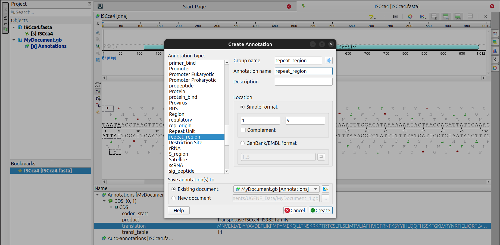
    <br/><br/>
 
  - As with `CDS`, we need to add some qualifiers. This is achieved by selecting the `repeat_region` and then pressing <kbd>Insert</kbd> ⌨️. You will get an "Add new qualifier" pop-up window to type in: 
    - Name: `rpt_type`, Value: `DIRECT`.
    
      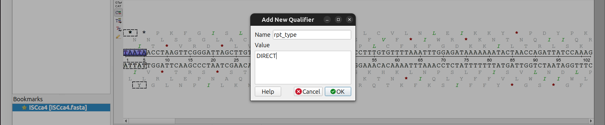
      <br/><br/>

    - Name: `note`, Value: `target site duplication generated by insertion of ISCca10`.

      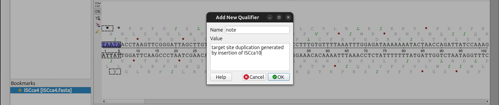
      <br/><br/>
 
  - Now, let's repeat the process for the right-flanking direct repeat.

</details>

---

#### Inverted repeats
<details>
  
  <summary>See more</summary>
  
  - To the **inverted repeats**! lets grab the first 30 and last 30 nucleotides after and before the annotated direct repeats. We can do this using the "Select sequence region" button () 🖱️, setting the ranges `6 - 35` and `978 - 1007` and then clicking  🖱️. Once region is selected, press <kbd>Ctrl + C</kbd> ⌨️ to copy the forward region (left) and <kbd>Ctrl + Shift + C</kbd> ⌨️ to copy the reverse complement of the reverse region (right).
    
    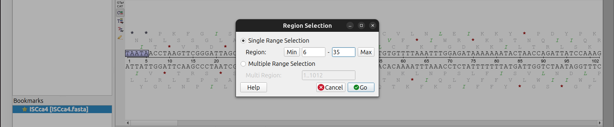
   
    Press <kbd>Ctrl + C</kbd> ⌨️
    <br/>
    
    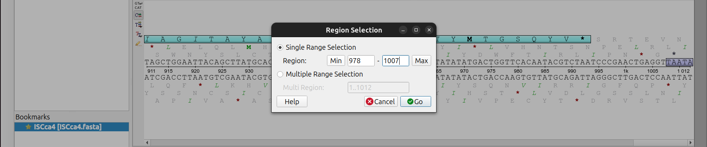
    
    Press <kbd>Ctrl + Shift + C</kbd> ⌨️
    <br/>

  - We can go ahead and align these sequences. So let's go to the [T-COFEE](https://tcoffee.crg.eu/apps/tcoffee/do:mcoffee) website and paste the IRL and IRR region sequences.

    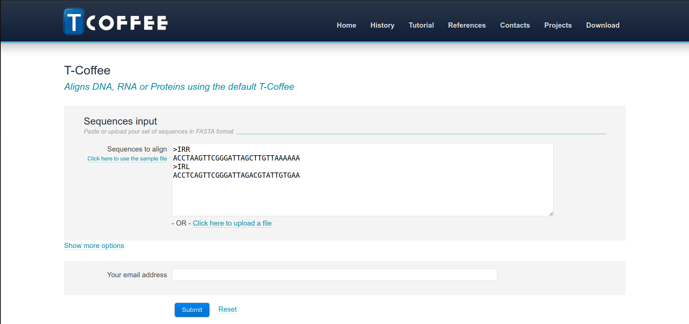
    <br/>

    - Lets look at the result. What is the sequence of the inverted repeat?

      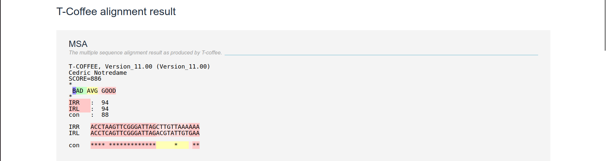
   
      ** ACCT(A/C)AGTTCGGGATTAG
      <br/>
   
    - How does this compare to the inverted repeat sequence of [`ISCca4`](https://isfinder.biotoul.fr/scripts/ficheIS.php?name=ISCca4)?
      
      ```
      ACCTAAGTTCGGGATTAG  # our IRL
      ACCTCAGTTCGGGATTAG  # our IRR
      ACGTCAGTTTTGGATTAGA # ISCca4 IRL (ISfinder, length 18/19)
      ACGTGAGTTTCGGATTAGA # ISCca4 IRR (ISfinder, length 18/19)
      ** * ****  *******  # sequence match
      ```
      <br/>
    
  - To create the annotations, use the search box in UGENE copy and pasting the identidied sequences for IRL (`ACCTAAGTTCGGGATTAG`) and IRR (`ACCTCAGTTCGGGATTAGA`).
    
    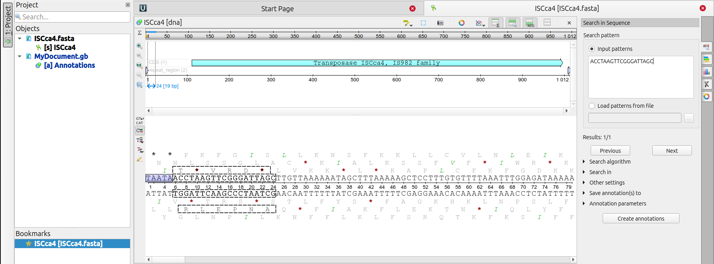
    <br/><br/>

  - After pasting, search will be automatic and region will be selected. For each, press <kbd>Ctrl + N</kbd> ⌨️. This will open the "Create Annotation" window. We will select `repeat_region` from the "Annotation type" menu, and write `repeat_region` in both "Group name" and "Annotation name" fields. Now let's click  🖱️.

    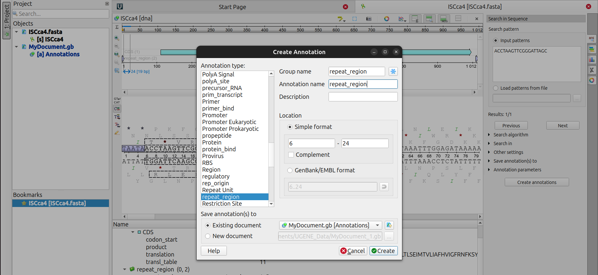
    <br/><br/>

    **\*Note:** For IRR, make sure to check the 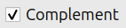 field.

    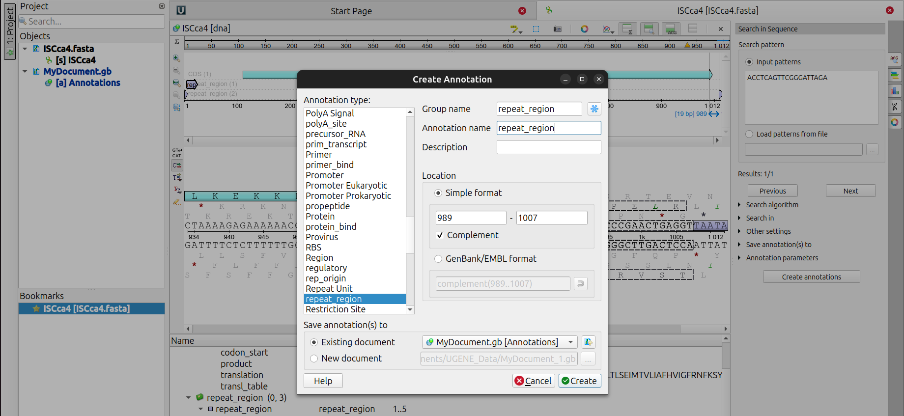
    <br/><br/>
 
  - As with `CDS`, we need to add some qualifiers. This is achieved by selecting the `repeat_region` and then pressing <kbd>Insert</kbd>. You will get an "Add new qualifier" pop-up window to type in: 
    - Name: `rpt_type`, Value: `INVERTED`.
      
      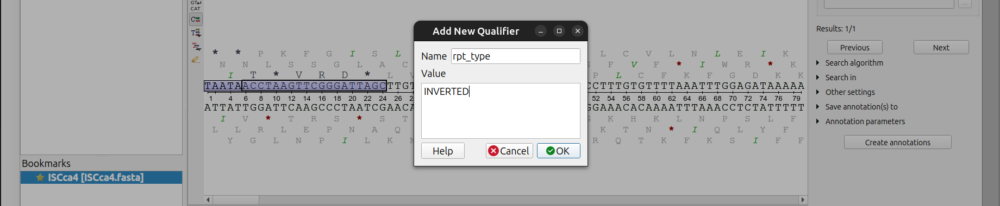
      <br/><br/>

    - Name: `note`, Value: `ISCca4, terminal inverted repeat IRL`.
      
      
      <br/><br/>
 
  - Now, let's annotate the other inverted repeat (IRR) in a similar fashion.

</details>

---

#### Mobile element feature
<details>
  
  <summary>See more</summary>
  Your current annotation should look somehting like this

  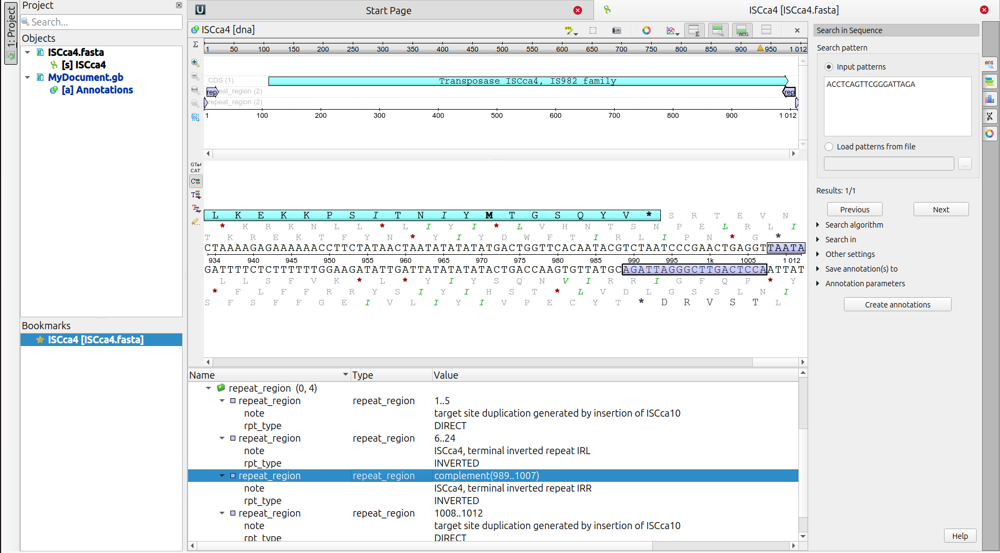
  <br/><br/>
  
  - Now that we have all features of the IS element annotated, we group them inside a `mobile_element` feature. For this, lets choose a range that covers all the mobile element, in this case, from IRL to IRR (`1 - 1012`) and click  🖱️.

    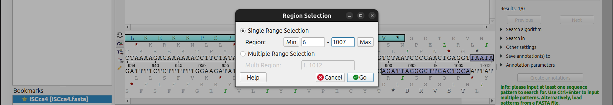
    <br/><br/>
    
  - Once the region is selected, press <kbd>Ctrl + N</kbd> ⌨️. This will open the "Create Annotation" window. We will select `mobile_element` from the "Annotation type" menu, and write `mobile_element` in both "Group name" and "Annotation name" fields. Now let's click  🖱️.

    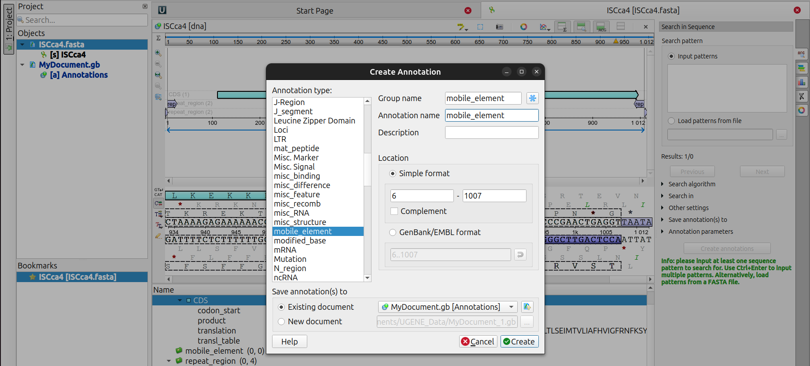
    <br/><br/>
 
  - As with `CDS` and `repeat_region`, we need to add some qualifiers. This is achieved by selecting the `mobile_element` and then pressing <kbd>Insert</kbd>. You will get an "Add new qualifier" pop-up window to type in: 
    - Name: `mobile_element_type`, Value: `insertion sequence:ISCca4`.
      
      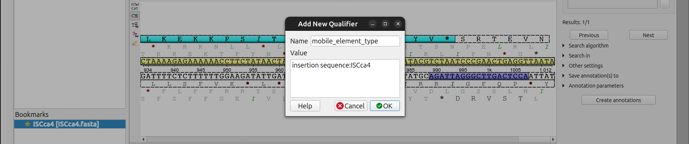
      <br/><br/>

    - Name: `rpt_family`, Value: `IS982`.
      
      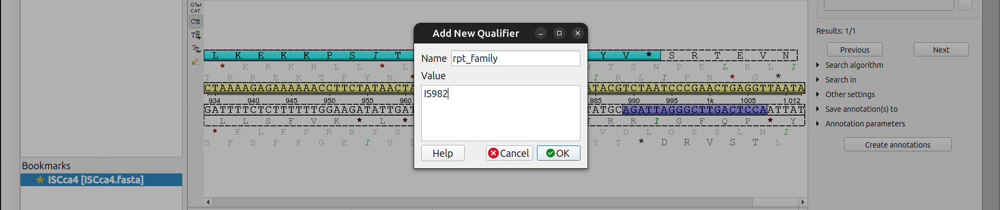
      <br/><br/>
      
    - Name: `rpt_type`, Value: `DISPERSED`.
      
      
      <br/><br/>
 
  - Done! Your annotaiton should look as follows.
    
    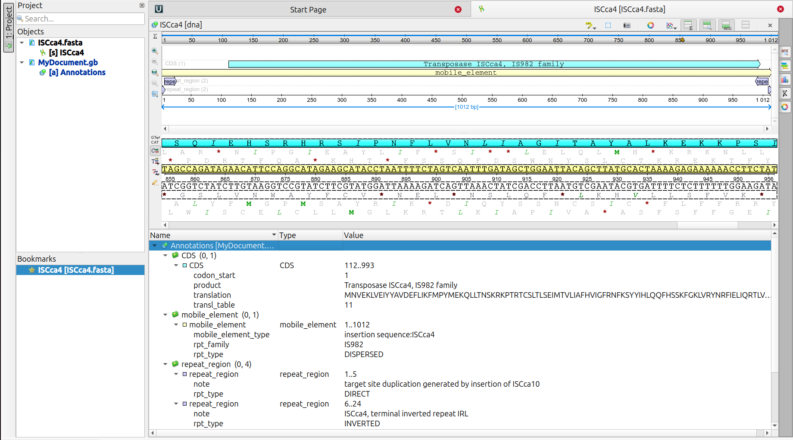

</details>

---

#### Exporting to GenBank format
<details>
  
  <summary>See more</summary>
  Now that we are done, we do not want to loose our work. So, let's go ahead and export the sequence along with the annotation in two simple steps
  
  - First, go to the left panel and find the sequence feature (`ISCca4.fasta` if you opened the file). Right click 🖱️ and go to `Export/Import -> Export sequences...`.

    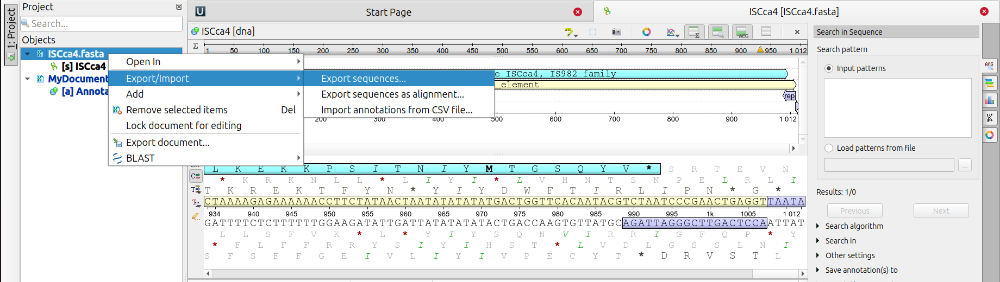
    <br/><br/>
    
  - Set the name of the output file to `ISCca4.gb` and select `GenBank` form the "File format to use" drop-down menu. Now click  🖱️.

    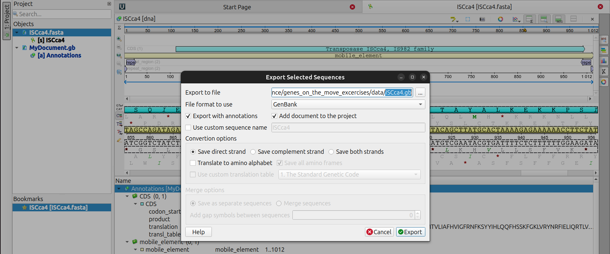
    <br/><br/>
 
  - Done!

  🥳 Congrats! If you made it all the way down here, you succesfuly annotated your first IS element! 🥳

</details>

---

## Further reading
**INSDC feature table:** [https://www.insdc.org/submitting-standards/feature-table/](https://www.insdc.org/submitting-standards/feature-table/).

ISfinder's *General Information* tab: [https://isfinder.biotoul.fr/general_information.php](https://isfinder.biotoul.fr/general_information.php).
<br/>

<p align="right">
    <kbd> <br> <a href="./Part_4.md"><big><b>Next: Part 4</b></big></a> <br> </kbd>
</p>
