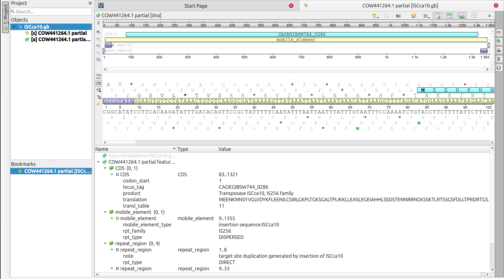
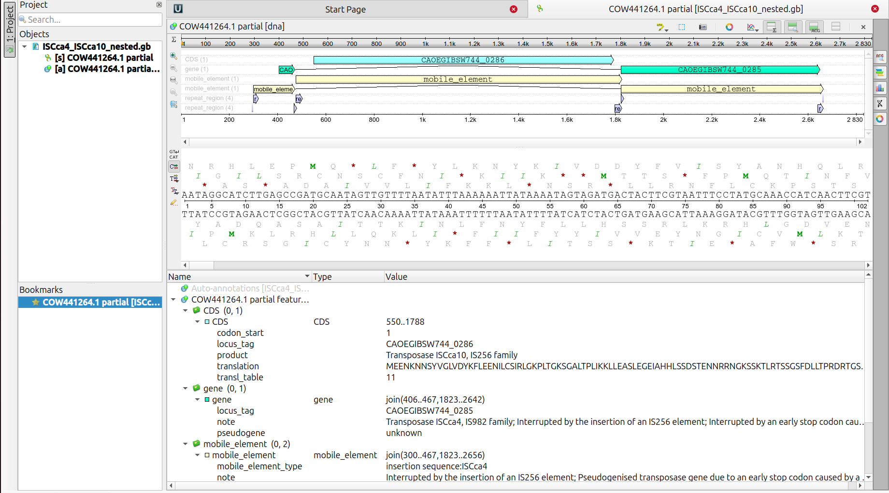

# Part 4: Annotate your own IS elements (independent)

## Annotate a single ISCca10
Here, its time to test yourself. Can you go through the process of annotating yourself an IS element now? For this part we will work with `ISCca10` from *Cardinium* bacteria. So, go ahead and download the [`ISCca10.fasta`](./data/ISCca10.fasta) (right click 🖱️ and download).

- Remember, you can start by dragging the downloaded file (`ISCca10.fasta`) into UGENE or open it (Top-left corner `File -> Open`).

Now, go!

  
  
See result

  
  - This is how your annotation should look like. You can also download the corresponding annotation file ([`ISCca10.gb`](./results/ISCca10.gb)) and check it against your own. Did you get it?

    

---

## Annotate nested IS elements (advanced)
Here, its time to test yourself, advanced mode! Can you go through the process of annotating yourself an IS element nested within another IS element? For this part we will work with `ISCca4` and `ISCca10` from *Cardinium* bacteria. So, go ahead and download the [`ISCca4_ISCca10_nested.fasta`](./data/ISCca4_ISCca10_nested.fasta) (right click 🖱️ and download).

- Remember, you can start by dragging the downloaded file (`ISCca4_ISCca10_nested.fasta`) into UGENE or open it (Top-left corner `File -> Open`).

Now, go!

  
  
See result

  
  - This is how your annotation should look like. You can also download the corresponding annotation file ([`ISCca4_ISCca10_nested.gb`](./results/ISCca4_ISCca10_nested.gb)) and check it against your own. Did you get it?

    

---

    <kbd>   <a href="./Part_5.md"><big><b>Next: Part 5</b></big></a>   </kbd>

