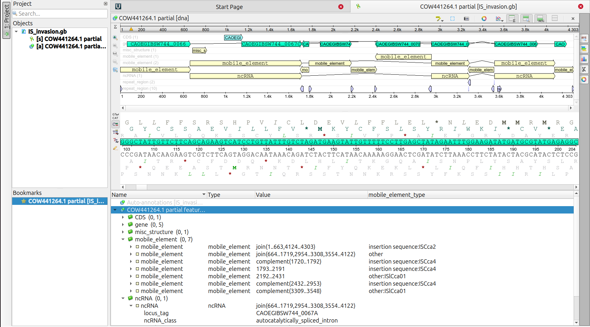

# Part 5: Annotate a complex IS element region and discussion
In this part we will go through a quite complex case of multiple nested insertions of mobile elements. This is a section to go through together and discuss.

## IS invasions (Matrix mode 💊🫲 😎 🫱💊)
When working with certain organisms, such as those endosymbionts mentioned in the presentation, mobile elements, including ISs, can get really wild, undergoing quite complex nested insertions.

- For this part we will work with a case of multiple nested insertions of MEs from *Cardinium* bacteria. So, go ahead and download the [`IS_invasion.gb`](./data/IS_invasion.gb) (right click 🖱️, open in new tab, then hit the "Dowload raw file" button at the top-right of the viewer). 

- Drag the downloaded file (`IS_invasion.gb`) into UGENE or open it (Top-left corner `File -> Open`).

- This is how the annotation should look like. Knowing what we know now, and knowing how to go through an annotation file, can you guess the correct order of invasions? 

  

  
  
See result

  
  - Based on the annotation, one can infer the following series of events:
    
    `ISCca2 <- ncRNA(Group II catalytic intron) <- MITE(ISlCca01,reverse),[ISCca4(reverse) <- [ISCca4 <- MITE(ISlCca01)]]`

---

We are done! Now you are an expert in annotation of ISs 👍. Thanks for sticking through!
